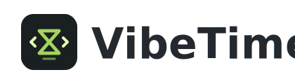

<p align="center">
  
</p>

<p align="center">
  Local-first time tracking for AI coding agents.
</p>

VibeTime runs quietly in the menu bar and records coding sessions from Claude Code,
Codex, Cursor, and Gemini CLI. It is built for answering a simple question well:
where did my agent-assisted work time go today?

## What It Does

- Tracks agent sessions and turns locally with SQLite.
- Shows today's live activity, completed work, and active turns.
- Provides history views with contribution-style heatmaps and useful project breakdowns.
- Installs and removes hooks for Claude Code, Codex, Cursor, and Gemini CLI from the app settings.
- Keeps data on your machine. No account, cloud sync, or hosted backend is required.
- Ships a small CLI through `~/.vibetime/bin/vibetime` for local checks and exports.

## Download

Download the latest build from [GitHub Releases](https://github.com/BarryYangi/vibetime/releases/latest).

- macOS Apple Silicon: download the latest `.dmg`
- Windows x64: download the latest setup `.exe`

## Install

### macOS

1. Download the latest macOS `.dmg` from Releases.
2. Open the DMG and drag `VibeTime.app` to `/Applications`.
3. Launch VibeTime.
4. Open Settings and enable the agents you want to track.

The app is not notarized yet, so macOS may require right-clicking `VibeTime.app`
and choosing `Open` on first launch.

### Windows

1. Download the latest Windows x64 setup `.exe` from Releases.
2. Run the installer.
3. Open Settings and enable the agents you want to track.

Windows support currently targets x64.

## Agent Notes

### Codex

VibeTime installs three Codex hooks:

- `SessionStart`
- `UserPromptSubmit`
- `Stop`

Codex may require one manual review step after installation. If Codex shows a
message like `hooks need review`, open `/hooks` in Codex and approve the VibeTime
hooks. This is Codex's safety boundary; VibeTime does not bypass it.

VibeTime uses Codex's current inline `config.toml` hook format and removes its
older entries from `~/.codex/hooks.json` to avoid mixed-source warnings.

### Claude Code, Cursor, and Gemini CLI

Claude Code, Cursor, and Gemini CLI hooks can be installed or removed from VibeTime
Settings. VibeTime preserves unrelated user hooks.

## Local Data

VibeTime stores data under:

- `~/.vibetime/data.db`
- `~/.vibetime/config.toml`
- `~/.vibetime/bin/vibetime`

The database is local SQLite. You can remove VibeTime's hooks from Settings before
uninstalling the app.

## Development

VibeTime is a pnpm workspace:

- `packages/core` - pure TypeScript domain logic and SQLite schema
- `packages/hook` - Bun-compiled hook and CLI binary
- `packages/desktop` - Electron, React, and the tray/menu bar app

Useful commands from the repo root:

```sh
pnpm typecheck
pnpm lint
pnpm test
pnpm depcheck
pnpm verify:core-zero-deps
pnpm run ci
```

Desktop builds:

```sh
pnpm --filter @vibetime/desktop pack:mac
pnpm --filter @vibetime/desktop dist:mac
pnpm --filter @vibetime/desktop pack:win
pnpm --filter @vibetime/desktop dist:win
```

Artifacts are written to `packages/desktop/release/`.

## License

MIT
